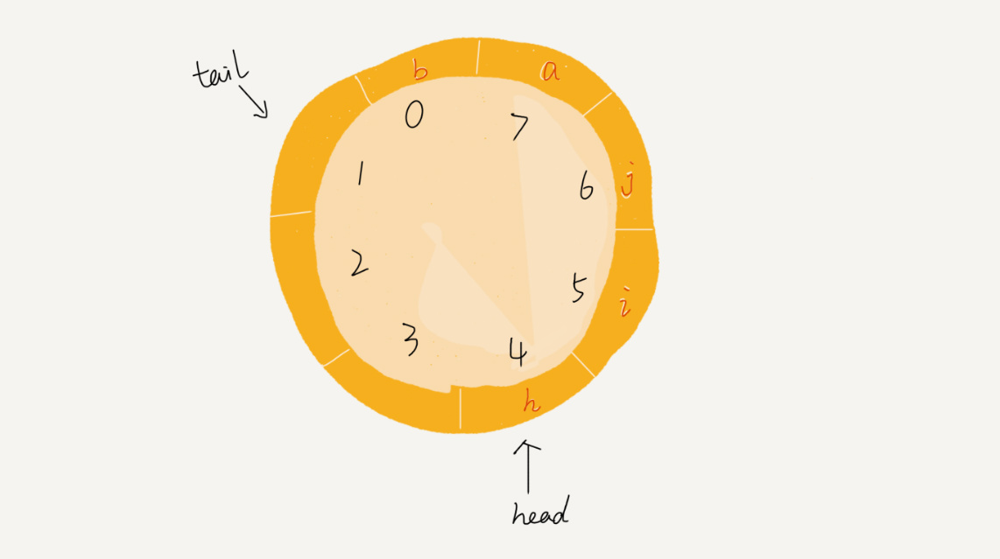
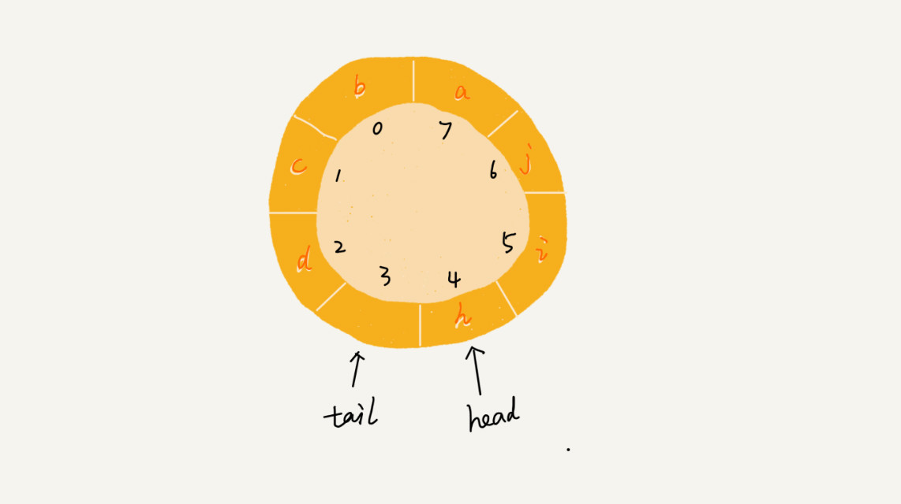

[TOC]

> 对于一个算法，或者一种数据结构，**有时候**只需要了解它的**由来、特性、应用场景及其能解决的问题**即可，至于它的**实现**，还有其他的方面，可以不做要求。

# Basic data structure: *array, list, stack, queue*

## 一、Array

* 线性表数据结构，用一组连续的内存空间，来存储一组具有相同类型的数据

* 线性表：每个元素最多只有前后两个方向；链表、队列、栈、数组都是线性表

* 非线性表：树、图、堆

* 杀手锏：随机访问

* 数组注意点：

  * 数组支持随机访问，根据下标随机访问的时间复杂度时O(1)
  * 随机访问≠查找；数组的查找最低是O(logn)（二分查找）
  * 数组的插入和删除的时间复杂度为O(n)

### 1.1 思想

* 避免数组多次的搬移工作

* * 如果往数组中第k个位置插入一个元素，可以先将第k个元素移动到数组尾部，在往第k个位置插入新元素
  * 如果删除多个元素，可以先把要删除的元素作一个标记，当所有要删除的元素都标记好了之后，再统一做删除以及数据搬移

### 1.2 问题

* 数组下标从0开始：

  * 随机访问的CPU效率问题
  * 历史原因，源于C，而后继承了C，所以继承了从0开始

### 1.3 数组的拓展

* 表的结构有两种，一种是顺序表、一种是链表；数组就是顺序表

* 一个完整的顺序表有两个部分，一个是表头，包含了容量和剩余空间等；一个是元素区，存放各个元素；

* 顺序表根据表头和元素区是否分离（即表头和元素区在内存上并不连续，但是表头记录了元素区的基址）分为一体式和分离式

* 顺序表根据元素区是存放着元素的地址还是元素本身，又有了元素外置的说法；

* 数组是支持动态扩容的，扩容有扩容的策略；

  * 策略有两种，一种是线性增长，一种是成倍增长；
  * 数组的扩容策略是变化的成倍增长，即当内存数达到一定数量，倍数会减小；

## 二、List

* 链表可以用来实现LRU缓存器

* 缓存淘汰策略常有：

* * FIFO；先进先出
  * LFU；最近常用策略
  * LRU；最近最少用策略

* 链表是通过指针将一组**零散的内存块**串联起来；天然支持动态扩容；

* 链表的分类：

  * 单链表
  * 循环链表
  * 双向链表

* 理论上讲，链表的插入与删除的时间复杂度为O(1)；而随机访问第k个元素的时间复杂度为O(n)，但是实际的问题需要另做考虑

* 链表做删除操作

* 无外乎以下两种场景：

  * 第一种，删除元素等于某个值的节点——需要先找出这个节点

  * d第二种，删除当前指针指向的节点——不需要另外找出

  * 第 1 种；都需要先遍历判断值，找到节点，遍历需要O(n)，然后再删除O(1)

  * 第 2 种，直接删除，O(1)；

* 双向链表在实际中更常用，它比单链表在某些场景中更高效；例如上述删除的第 2 中情况中，如果要删除的是当前指针指向节点的前一节点，则对于双向链表而言，还是O(1)，但是对于单链表，则需要再一次遍历整个链表，找到当前节点的前一节点，所以是O(n)

* 数组和链表的选择——很多时候不能单单看时间复杂度

  * 数组是一块连续的内存空间，可以借助CPU缓存来预读数据，所以访问的效率更高；而链表因为不连续，所以没办法
  * 数组的缺点在于内存大小固定，不够灵活；如果申请的内存过大，可能出现内存不足的情况，过小，再申请的时候需要进行数据迁移，效率低；链表则天然支持动态扩容，没有上面这些问题；这也是链表与数组最大的区别

* 哨兵节点

  * 哨兵节点一般不放数据，主要用来简化代码的边界考虑情况；
  * 不参与实际的业务逻辑，只是做一个边界区分
  * 根据有无哨兵节点，可以分为有头链表和无头链表；

* 编写链表时，需要考虑的边界条件

  * 链表为空
  * 链表只有一个节点
  * 链表只有两个节点
  * 处理头节点和尾结点

* 关于链表的代码练习题

  * 单链表的反转（`LeetCode 206`）
  * 链表中环的检测（`LeetCode 141`）
  * 两个有序链表的合并（`LeetCode 21`）
  * 删除链表倒数第 n 个节点（`LeetCode 19`）
  * 求链表的中间节点（`LeetCode 876`）

## 三、Stack

栈的核心思想：**先进后出**（FIFO）；很深的感触是，栈不仅是一种数据结构，也是一种思想；

 栈可以用数组来实现，也可以用链表；所以也分为顺序栈和链式栈；
### 1.1 栈的经典应用：
* 函数调用栈；
* 表达式求值，例如 3 + 5 * 8 - 6；
    1. 定义两个栈，一个存放操作数，叫 `data`；一个存放操作符，叫 `operators`；
    2. 从左到右遍历表达式，如遇操作数，则 `push to data`
    3. 如遇操作符，则跟 `operators` 的栈顶操作符做优先级比较，如果大，则 `push to operators`；如果小，则从 `data` 中 `pop` 出两个操作数，进行操作；然后把操作结果 `push to data`，接着，该操作符继续比较；直到 `data` 和 `operators` 都为空；
* 括号匹配
    1. 定义一个栈，从左到右遍历字符串
    2. 如扫描到左括号，则入栈
    3. 如扫描到右括号，则判断是否跟栈顶的左括号相匹配，如果匹配，则将栈顶的左括号取出，然后继续扫描；如果不匹配或者栈为空，则说明括号格式不合法
    4. 当扫描完所有括号，栈为空，则说明合法；否则，括号组合不合法；
* 浏览器页面的前进和后退
    1. 定义两个栈 `X` 和  `Y`
    2. 每次浏览一个页面，都把页面放到栈 `X` 中，栈顶页面，就是当前浏览的页面
    3. 当后退时，则将 `X` 的栈顶页面弹出，然后放到栈 `Y` 中
### 1.2 相关题目
关于栈，在 `LeetCode` 上对应的题：20，155，232，  844，224，682，496

## 四、Queue

>下面实现，如果无特殊说明，默认使用数组。
### 2.1 引入前言
 CPU的资源是有限，任务的处理速度并不跟线程的个数呈正相关，相反，过多的线程会导致CPU的频繁的切换，使得处理性能下降，所以引入线程池来控制线程，而线程池的大小是需要综合处理任务特性和硬件环境来设计的，线程池的底层实现结构，就是 **队列**！很多关于有限资源调用的场景，大都可以使用队列来进行排队请求；

### 2.2 基本队列
队列的核心思想是：**先进先出（FIFO）**
队列可用数组或链表实现；用数组实现为顺序队列，用链表为链式队列；**一般常用数组实现。**
#### 2.2.1 基本操作、思想和代码
##### 基本操作
**入队（enqueue）、出队（dequeue）、判空、当前队列元素个数（size）；**
##### 核心思想
* Python中，数组（ **动态扩容 + pop()** ）实现队列，会造成**频繁的数据搬移**，为了避免多次**数据搬移操作**，会使用 `数组（固定大小） + 双指针 + 手动搬移数据` 实现，**核心思想**在于先标记 `出队元素`，等到 `队满了` 再统一进行数据搬移；
* 双指针分别指向队头、队尾；
##### 代码实现
边界条件：
* 队列判空：head == tail
* 队列判满：tail == capacity
```python
class Queue(object):
    def __init__(self, capacity):
        self.__capacity = capacity
        self.__list = [None] * capacity
        self.__head = 0
        self.__tail = 0

    def is_empty(self):
        # 由于要标记删除，所以队列为空，但 self.__list 不一定为空
        # 所以只能用 self.__head == self.tail 来判断
        return self.__head == self.tail

    def size(self):
        """返回队列当前存放元素的个数"""
        return self.tail - self.head

    def enqueue(self, item):
        """入队"""
        if self.__tail == self.__capacity:  # 队满，可能需要进行数据搬移
            if self.__head == 0:
                return False  				# 容量已满，拒绝入队。
            for i in range(self.__head, self.__tail):
                # 将元素整体向前移动 self.__head 个单位
                self.__list[i - self.__head] = self.__list[i]
            # 更新 head 和 tail 的位置
            self.__head = 0
            self.__tail -= self.__head
        # 入队操作
        self.__list.[self.__tail] = item
        self.__tail += 1
        return True  # 返回True表示入队成功

    def dequeue(self):
        """出队"""
        if self.is_empty():
            return None
        else:
            res = self.__list[self.__head]
            self.__head += 1
            return res
```
### 2.3 队列的变体
由于各种特殊情境的需求，我们常会在基本队列上加入一些特性，得到队列的变体，在此称为**特殊队列**。例如：**循环队列**、**阻塞队列**、优先队列、**并发队列**、分布式消息队列。两个特殊队列，也可以组合，例如**高性能队列 Disruptor、Linux 环形缓存**用的是循环并发队列，**Java concurrent并发包**利用 **ArrayBlockingQueue（阻塞队列）** 来实现**公平锁**。

#### 2.3.1 循环队列（重要，必会）
使用**数组**实现队列，即便利用**双指针**来**标记清除**，也只能够使数据搬移的次数减少而已，当数组满了之后，同样需要申请新的内存，进行数据搬移；如果**想要完全避免数据搬移**，则可以用**循环的思想**来解决，此时的队列，就是**循环队列**。下面就是循环队列的示例图：

可以看出，这个循环队列的数组大小 `capacity == 8`。假如当前状态 `head == 4`，`tail == 7`，`a` 入队，`tail` 不更新为 `8`，而是将其在环中后移一位，使`tail` 更新为`0`，当又有一元素 `b` 入队，则将 `b` 放在 `0` 的位置上，`tail` 后移更新为 `1`

##### 基本操作
判空、**队列当前剩余元素个数（size）**、**入队**、**出队**
##### 循环队列代码实现（`Code`）
关键在于**确定队空和队满的判定条件**，以及 **size 如何计算**

由上图，可以分析出：

* 队空的判定条件：head == tail
* **队列判满：（tail + 1）% capacity == head**
* **队列当前剩余的元素个数 size**
    * 当 `tail > head` 时，` size = tail - head`
    * 当 `tail < head` 时， `size = capacity - （head - tail）`

同时，循环队列队满时，`tail` 所指位置并没有存放元素；所以**循环队列是会浪费一个单位内存的**。
```python
class CircularQueue(object):
    def __init__(self, capacity):
        self.__capacity = capacity
        # self. __list = [None for in range(capacity)]
        self.__list = [None] * capacity
        self.__head = 0
        self.__tail = 0
       
    def is_empty(self):
        return self.__head == self.__tail
        
    def size(self):
        """返回当前循环队列中的元素个数"""
        # 即使队满，tail 所指的位置也没有存放元素，所以 size 最大为 capacity - 1
        if self.__tail >= self.__head:
            return self.__tail - self.__head
        else:
            return self.__capacity - (self.__head - self.__tail)
    
    def enqueue(self, item):
        """入队"""
        if (self.__tail + 1) % self.__capacity == self.__head:
            return False  # 循环队列队满，拒绝入队。
        self.__list[self.__tail] = item
        self.__tail = (self.__tail + 1) % self.__capacity  # 入队后 tail 的更新
        
    def dequeue(self):
        """出队"""
        if self.is_empty():
            return None
        res = self.__list[self.__head]
        self.__head = (self.__head + 1) % self.__capacity
        return res
```
#### 2.3.2 阻塞队列
**对于等候资源分配的场景，一般使用队列来实现排队分配。** 队列容量有限，一旦队满或队空，入队和出队响应会有两种机制，一种是直接拒绝入队出队，而另一种则是阻塞，这就是阻塞队列。

简单地讲，就是**队空时，出队阻塞，等待队中有数据时再取出；队满时，入队阻塞，等候队中有空位置时再入队。**
##### 应用场景
* **生产者-消费者模型：** 协调生产与消费的速度。
    1. 生产过快，来不及消费，则队满阻塞，降低生产速度
    2. 生产过慢，供不应求，则队空阻塞，提高生产速度
#### 2.3.3 并发队列
多线程情况下，会有多个线程同时操作队列，这时会出现线程安全问题，为了解决这个问题而设计的队列，叫做并发队列。
##### 实现思想
最简单直接的方法是在 `enqueue()`、`dequeue` 方法上加锁，但这样同一时刻仅允许一个线程的操作，并发性会降低。

更优的方式是，基于数组的循环队列，再利用 `CAS` 原子操作，可以实现非常高效的并发队列，例如**高性能队列Disruptor**。

### 2.4 基于链表的队列
基于链表的实现方式，可以实现一个**支持无限排队的无界队列（unbounded queue）**，但是可能会导致过多的请求排队等待，请求处理的响应时间过长。所以，**针对响应时间比较敏感的系统，基于链表实现的无限排队的线程池是不合适的。**

### 2.5 练习
* 实现基于标记清除的基本队列
* 实现循环队列
* 实现无锁并发队列
* 实现阻塞队列