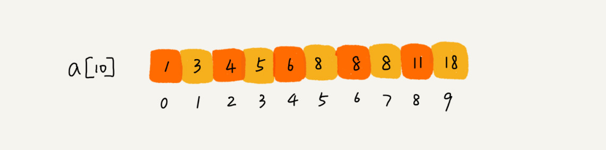

[TOC]

# 二分查找详解

## 一、如何用最省内存的方式实现快速查找功能？

查找算法很多，常用的有顺序查找、哈希查找、广度优先遍历、深度优先遍历以及二分查找。

* 顺序查找，即最简单粗暴的遍历查找。
* 哈希查找，即利用散列表的随机访问时间复杂度为`O(1)`来实现查找，Python中常见的散列表是字典、集合
* 广度优先遍历（`BFS`）和深度优先遍历（`DFS`），利用二叉查找树

哈希查找、`BFS`以及`DFS`的效率很高，其依赖的数据结构（散列表、二叉树）的构建相对来说比较占用空间，而二分查找则比较省内存空间。**然而，凡是能用二分查找的解决的，绝大部分我们会倾向用散列表或二叉查找树**，因为虽然它们比较占内存，但很多时候影响并不大。

在这里，主要介绍**二分查找**，尤其是**二分查找的变形题**，可以说是二分查找算法的专用场景。

### 1.1 核心思想（基于有序数组）

二分查找针对的是一个有序的数据集合，每次都通过跟区间的中间元素对比，将待查找的区间缩小为之前的一半，直到找到要查找的元素，或者区间被缩小为 `0`。

### 1.2 时间复杂度分析：`O(logn)`


### 1.3 二分查找的局限性

* 二分查找依赖**顺序表结构**，即**数组**。不可以用**链表**，因为二分查找的时间复杂度低主要来自于**数组支持下标随机访问，且时间复杂度为`O(1)`。**而链表为`O(n)`，如果用链表，那二分查找的时间复杂度会变得很高。
* **二分查找针对有序数组**

基于第一点的拓展，由于**二分查找基于顺序表结构**，其在内存中连续，因为在实际应用中，要是数据量太大，是无法使用二分查找的。

### 1.4 简单二分查找的代码

#### 1.4.1 非递归写法

```python
def binary_search(alist, target):
    """
    alist有序，alist 数组中没有重复元素，用简单的二分查找确定 target 是否在数组中，
    如果在，返回下标，如果不在，返回 -1。
    用非递归的形式实现。
    Difficulty: easy
    :param alist: 有序数组
    :param target: 待查找的元素
    :return: 如果不在，返回 -1，如果在，返回结果下标
    """
    alist_len = len(alist)         # 先求出数组长度
    low = 0                        # 定义两个初始指针，分别指向第一个元素和最后一个元素
    high = alist_len - 1
    while low <= high:             # 当 low <= high 时，注意要 =
        mid = low + ((high - low) >> 1)  # mid 的最优写法，通用且位操作效率更快，
        if alist[mid] == target:
            return mid
        elif alist[mid] < target:
            low = mid + 1
        else:
            high = mid - 1
    return -1
```

#### 1.4.2 递归写法

```python
def binary_search(alist, low, high, target):
    """
    alist有序，alist 数组中没有重复元素，用简单的二分查找确定 target 是否在数组中，
    如果在，返回下标，如果不在，返回 -1。
    用递归的形式实现。
    Difficulty: easy
    :param alist: 有序数组
    :param target: 待查找的元素
    :return: 如果不在，返回 -1，如果在，返回结果下标
    """
    if low > high:          # 递归终止条件，当 low > high 时，说明查询完毕，且没有找到元素
        return -1
    mid = low + ((high - low) >> 2)
    if alist[mid] == target:
        return mid
    elif alist[mid] < target:
        return binary_search(alist, mid+1, high, target)
    else:
        return binary_search(alist, low, mid-1, target)
    
"""analyse
原地查找，使用了双指针；time complexity is O(logn)；
相比非递归，两者基本差不多，虽然递归需要调用系统栈，但由于二分查找的次数很少，
所以哪怕规模很大的数据，也基本不会出现栈溢出；
需要注意的是，递归终止的条件；
非递归写法，相对复杂，但还是比递归效率更高，所以之后的写法，大都用非递归写法。
"""
```

## 二、如何快速定位 `IP` 对应的省份地址？

该问题使用二分查找即可解决。二分查找有变体，之前我们学的二分查找只是最简单的一种，给定的数据并没有重复值。但是实际应用中，常用到的是二分查找的变体。下面分析**四种典型的二分查找的变体**

* 查找第一个等于 `target` 的元素
* 查找最后一个等于 `target` 的元素
* 查找第一个大于等于 `target` 的元素
* 查找最后一个小于等于 `target` 的元素

若无特殊说明，上面四个问题是基于从小到大的有序数组，且数组中的数据可能出现重复。

### 2.1 查找第一个等于 `target` 的元素

在给定的数组中，查找第一个等于`target`元素，如果存在，则返回下标，否则，返回`-1`。



如给定上述数组，找出第一个等于`8`的元素，并返回第一个等于`8`的元素的下标。

#### 2.1.1 代码

```python
def binary_search(alist, target):
    """
    数据有重复值，查找出第一个等于 target 的元素，返回下标，若不存在，返回 -1
    Difficulty: easy
    :param alist: 给定有序数组
    :param target: 要查找的目标值
    :return: 目标值在数组中的下标，如果不存在则返回 -1
    """
    low = 0                         # 定义两个指针，low 和 high，分别指向第一个和最后一个元素
    high = len(alist) - 1
    while low <= high:              # 当 low <= high 时，所以数组还没查找完毕
        mid = low + ((high - low) >> 1)
        if alist[mid] > target:
            high = mid - 1
        elif alist[mid] < target:
            low = mid + 1
        else:                       # 如果 alist[mid] == target
            """继续判断 mid 是否为数组的第一个元素，是则直接返回，如果不是，
            则再判断 mid 前一个元素是否等于 target，如果不是，
            说明 alist[mid] 为数组中第一个等于 target 的元素，
            否则，说明不是第一个，再调整查找范围。"""
            if mid == 0 or alist[mid-1] != target:
                return mid
            else:
                high = mid - 1
    return -1

"""analyse
该题为简单二分查找的变体形式，即数组中存在重复元素，要找出第一个等于 target 的元素；
时间复杂度还是 O(logn)，重点在于当 alist[mid] == target 时，要进一步判断是否是数组中的第一个。
"""
```

### 2.2 查找最后一个等于 `target` 的元素

```python
def binary_search(alist, target):
    """
    数据有重复值，查找出最后一个等于 target 的元素，返回下标，若不存在，返回 -1
    Difficulty: easy
    :param alist: 给定有序数组
    :param target: 要查找的目标值
    :return: 目标值在数组中的下标，如果不存在则返回 -1
    """
    low = 0                         # 定义两个指针，low 和 high，分别指向第一个和最后一个元素
    high = len(alist) - 1
    while low <= high:              # 当 low <= high 时，所以数组还没查找完毕
        mid = low + ((high - low) >> 1)
        if alist[mid] > target:
            high = mid - 1
        elif alist[mid] < target:
            low = mid + 1
        else:                       # 如果 alist[mid] == target
            """继续判断 mid 是否为数组的最后一个元素，是则直接返回，如果不是，
            则再判断 mid 后一个元素是否等于 target，
            如果不是，说明 alist[mid] 为数组中最后一个等于 target 的元素，
            否则，说明不是最后一个，再调整查找范围。"""
            if mid == (len(alist)-1) or alist[mid+1] != target:
                return mid
            else:
                low = mid + 1
    return -1

"""analyse
该题为简单二分查找的变体形式，即数组中存在重复元素，要找出最后一个等于 target 的元素；
时间复杂度还是 O(logn)，重点在于当 alist[mid] == target 时，要进一步判断是否是数组中的最后一个。
"""
```

### 2.3 查找第一个大于等于 `target` 的元素

```python
def binary_search(alist, target):
    """
    数据有重复值，查找出第一个大于等于 target 的元素，返回下标，若不存在，返回 -1
    Difficulty: easy
    :param alist: 给定有序数组
    :param target: 给定的目标值
    :return: 目标值在数组中的下标，如果不存在则返回 -1
    """
    low = 0                         # 定义两个指针，low 和 high，分别指向第一个和最后一个元素
    high = len(alist) - 1
    while low <= high:              # 当 low <= high 时，所以数组还没查找完毕
        mid = low + ((high - low) >> 1)
        if alist[mid] >= target:
            """继续判断 mid 是否为数组的第一个元素，是则直接返回 mid，如果不是，
            则再判断 mid 前一个元素是否大于等于 target, if not,
            the alist[mid] is the first elem greater than or equal to the target,
            otherwise, not the first, should adjust the search range."""
            if mid == 0 or alist[mid-1] < target:
                return mid
            else:
                high = mid - 1
        else:                       # if alist[mid] < target
            low = mid + 1
    return -1

"""analyse
该题为简单二分查找的变体形式，即数组中存在重复元素，要找出第一个大于等于 target 的元素；
时间复杂度还是 O(logn)，重点在于当 alist[mid] >= target 时，要进一步判断是否是数组中的第一个。
"""
```

### 2.4 查找最后一个小于等于 `target` 的元素

```python
def binary_search(alist, target):
    """
    数据有重复值，查找出最后一个小于等于 target 的元素，返回下标，若不存在，返回 -1
    Difficulty: easy
    :param alist: 给定有序数组
    :param target: 给定的目标值
    :return: 目标值在数组中的下标，如果不存在则返回 -1
    """
    low = 0                         # 定义两个指针，low 和 high，分别指向第一个和最后一个元素
    high = len(alist) - 1
    while low <= high:              # 当 low <= high 时，所以数组还没查找完毕
        mid = low + ((high - low) >> 1)
        if alist[mid] <= target:
            """继续判断 mid 是否为数组的 last elem，if true, return mid, if not,
            judge whether the next elem of the mid is less than or equal to 
            the target, if not, the alist[mid] is the last elem less than or equal 
            to the target, otherwise, not the last, should adjust the search range."""
            if mid == (len(alist) - 1) or alist[mid+1] > target:
                return mid
            else:
                low = mid + 1
        else:                       # if alist[mid] > target
            high = mid - 1
    return -1

"""analyse
该题为简单二分查找的变体形式，即数组中存在重复元素，要找出最后一个大于等于 target 的元素；
时间复杂度还是 O(logn)，重点在于当 alist[mid] <= target 时，要进一步判断是否是数组中的最后一个。
"""
```

### 2.5 思考题

`LeetCode 33` 题


