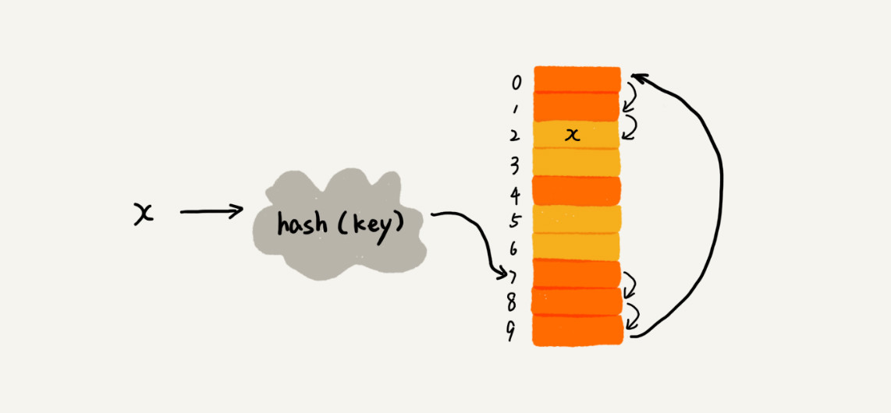

[TOC]

# 散列表（`Hash Table`）

> 散列表核心：基于数组支持通过下标随机访问元素的特性，且时间复杂度为`O(1)`

## 一、什么是散列表


简单地说，散列表是对数组的拓展，**将`key`通过散列函数`hash function`映射为数组的下标，然后将`key`对应的信息放在下标对应的位置中。**这样子，当我们查找的时候，可以先将`key`通过`hash function`映射为下标，再以`O(1)`的时间复杂度中数组中取出。

## 二、散列函数（`hash function`）

### 2.1 散列函数的基本要求

散列函数是需要根据具体情况具体构建的，但其应该满足以下三个基本条件：

* 散列函数计算得到的散列值是一个非负整数（因为散列值要作为数组的下标）
* 如果 `key_01 == key_02`，那 `hash(key_01) == hash(key_02)`
* 如果 `key_01 != key_02`，那 `hash(key_01) != hash(key_02)`

关于第三点，`key`不同，其散列值也一定不同的散列函数是基本不存在，当`key`不同，却出现相同的散列值时，就会发生冲突，这就是**散列冲突**。可以说，散列冲突是不可避免的，哪怕是业内著名的散列算法，如：`MD5`、`SHA`、`CRC`，也无法完全避免散列冲突。此外，散列表是基于数组的，数组在内存的储存空间有限时，也会加大散列冲突的概率。

### 2.2 什么是好的散列函数

>  基于对散列冲突无法避免的认知以及满足三个基本条件的情况下，来衡量怎样的散列函数才是好的呢？

* 散列函数不能太复杂；散列值需要经过计算得到，要是散列函数太复杂，计算时间会太长

* 经过散列函数生成的散列值要尽可能地随机，并且均匀分布；随机是为了尽可能地减少散列冲突，均匀使得即便出现了冲突，冲突也会均匀地出现在每个`slot`中，而不会集中出现在某个`slot`中，如果极端集中，会使效率变得很低。

### 2.3 如何构建散列函数

> 实际工作中，散列函数的构建需要参考诸多因素，e.g. key's length, characteristics, distribution, etc., as well as the size of the hash table. Here are a few common, simple build methods.

#### 2.3.1 数据分析法

> 通过分析`key`的数据特征来提取散列函数

例如，运动会。分析参赛者编号的特征，把编号中的后两位作为散列值。

例如，手机号码。手机号码前几位重复的可能性很大，后面几位比较随机，可以取后四位作为散列值。

例如，Word 拼写检查功能。将单词中每个字母的 `ASCll` 码值 “进位” 相加，然后再跟散列表的大小求余取模，作为散列值。e.g. nice ==> hash value

```python
hash("nice") = (("n" - "a") * 26*26*26 + ("i" - "a")*26*26 + ("c" - "a")*26 + \
                ("e"-"a")) / 78978
```

#### 2.3.2 其他方法

散列函数的设计方法有很多，例如直接寻址法、平方取中法、折叠法、随机数法, etc..

But we don't need to master it all, just understand it.


## 三、如何处理散列冲突

> 再好的散列函数，也无法避免散列冲突，那我们该如何处理散列冲突呢？
>
> 常见的方法有两种：**开放寻址（`open addressing`）、链表法（`chaining`）**

### 3.1 `Open Addressing`

开放寻址是一种类型，其核心思想在于**如果出现了散列冲突，就再探测一个新的位置。**具体常用的方式有三种：

* 线性探测（`Linear Probing`）
* 二次探测
* 双重散列

下面具体分析一下**线性探测**的**插入、删除和查找**

##### 线性探测的插入

当我们往散列表插入数据时，`key`经过散列函数得到散列值，但散列值对应的下标位置已经被占据，那此时就要从该位置继续往下遍历，知道找到一个空闲位置，再将数据插入，如下图。



> 图中橙色方块表示位置已被占据，黄色方块表示空闲，此时要插入值为`x`，已知其散列值为`7`

##### 线性探测的查找

当我们要从散列表中查找某个元素时，其`key`先经由散列函数生成散列值，再对比散列值对应下标位置的值是否与所要查找的元素相同，如果不相同，则再从当前位置往后遍历查找，直到遇到空闲位置，说明该元素不在散列表中。

##### 线性探测的删除

当我们要从散列表中删除一个元素，必先要查找到这个值。但是删除的时候，并不能直接删除，而只能用`is_deleted`标记起来。原因在于**如果直接删除了，那下一次的查找就无法进行了，因为查找时碰到空闲位置就会认为元素不存在而直接返回，无法遍历全部。**

#### 3.1.1 二次探测与双重散列

##### 二次探测

二次探测跟线性探测思路相同，只是当发生冲突时，线性探测是以步长为`1`，继续往下探测。而二次探测则是以步长为**平方**，继续往下探测，即 $$hash(key), hash(key) + 1^2, hash(key) + 2^2, hash(key) + 3^2.....$$，直到找到空闲位置

##### 双重散列

准备多个散列函数，当第一个散列函数发生散列冲突，则再用另一个散列函数进行探测。

### 3.2 `Chaining`


散列表中的每个桶（`bucket`）或槽（`slot`）都对应一条链表，当发生冲突时，即散列值相同时，把值放在链表的后边。此时散列表的插入、删除操作为`O(1)`，查找则为`O(k)`，`k`是链表的长度。

### 3.3 散列表的隐患及其控制

当散列表的空闲位置不多时，散列冲突的概率会大幅度提高。此时插入、删除、查找操作的时间复杂度会很高，使散列表的效率降低。为了控制这一情况，通常我们会**设置装载因子（`load factor`）来监控散列表中空闲的位置，保证散列表有适合数量的空闲位置，从而保证其效率。**

#### 3.3.1 `load factor`

> 装载因子的公式：装载因子 = 元素已有个数 / 散列表的长度​

装载因子越大，说明空闲位置越少，冲突概率越大，散列表的效率越低。

对于动态的散列表，不断往表中添加数据，那装载因子变大是不可避免的。但是有一个可接受的范围，只有当装载因子过大，大于我们设置的某个阈值时，我们就会采取扩容措施，为散列表申请一块更大的空间，并进行数据搬移。（**本质是数组的动态扩容**；**扩容策略**）

如果对内存敏感的情景，还可以根据 load factor 来动态缩容。但不管是扩容还是缩容，都涉及数据搬移，这就需要 overhead。因此总是需要根据需求来选择。

#### 3.3.2 如何避免低效的动态扩容

> 对于动态的散列表，数据插入，装载因子变大，效率变低是必然的。此时的解决方法就是扩容，增加空闲位置，降低装载因子。因此扩容是必须的，扩容需要数据搬移，重新计算旧表中的散列值，这需要额外的时间消耗，如果旧表中的数据量很大，那一次性搬移的代价就会很大。此时我们该怎么避免这种情况呢？

当需要扩容时，可以先申请一块内存空间，申请后并不直接将旧表数据进行迁移，而是等有新数据插入时，直接将新数据插入到新表中，并从旧表中迁移少量的数据。多次之后，旧表数据便可迁移完。在此期间，查找则先从新表中查找，要是没找到，再到旧表中查找。


上面的做法就避免了低效的扩容，使得每次操作的时间复杂度均在`O(1)`

### 3.4 如何选择冲突解决方法

> 这里主要分析`Open Addressing`以及`Chaining`的选择，这两种也是实际中最常用的。虽然大多数情况下，`Chaining` 更加普适。

#### 3.4.1 开放寻址法的优缺点

> **优点**

* 使用开放寻址法来解决冲突的散列表，数据都是存放在数组中，而根据数组的特性，其可以利用 `CPU` 缓冲来加快查询速度。
* 便于序列化

> **缺点**

* 删除数据时比链表法麻烦，需要做删除标记
* 浪费内存空间。因为需要控制空闲位置的数量，即控制装载因子，数组总不会存满，会浪费较多的内存。

> **Summary**

当数据量较小时，适合用开放寻址，例如 `Java` 中的 `ThreadLocalMap`。

#### 3.4.2 链表法的优缺点

> **优点**

* 对内存的利用更为灵活，对空闲位置数量更为容忍。因为链表法是从数组每个 slot 拉出链表，冲突多，也只是链表变长，查找效率下降。
* 支持多种优化策略。例如可以将 slot 拉出来的链表改用跳表或者红黑树。这样子无论散列表如何退化，查找的时间复杂度也在`O(logn)`

>**缺点**

* 链表无法使用`CPU`缓存
* 链表也比较占内存，因为链表节点需要存放指针。但如果散列表存储的是大对象，这个缺点是可以忽略的。

> **Summary**

当数据规模较大、数据对象较大时，适合用链表法。链表法支持多种优化策略，例如将链表改用跳表或者红黑树。

## 四、`Java` 中的 `HashMap` 

1. 初始大小

   `HashMap` 默认的数组初始大小是 `16`，当然这个默认值是可以设置的，如果事先知道大概的数据量有多大，可以通过修改默认初始大小，减少动态扩容的次数，这样会大大提高 `HashMap` 的性能。

2. 装载因子和动态扩容

   最大装载因子默认是 `0.75`，当 `HashMap` 中元素个数超过 `0.75 * capacity`（`capacity` 表示散列表的容量）的时候，就会启动扩容，每次扩容都会扩容为原来的两倍大小。

3. 散列冲突解决方法

   `HashMap` 底层一开始采用链表法来解决冲突。这样即使负载因子和散列函数设计得再合理，也免不了会出现拉链过长的情况，一旦出现拉链过长，则会严重影响 `HashMap` 的性能。

   于是，在 `JDK1.8` 版本中，对 `HashMap` 引入了红黑树。当链表长度太长（默认超过 `8`）时，链表就转换为红黑树。利用红黑树快速增删改查的特点，提高 `HashMap` 的性能。当红黑树结点个数少于 `8` 个的时，又将红黑树转化为链表。因为在数据量较小的情况下，红黑树平衡维护比链表更耗时间。

## 五、散列表与链表变体的组合使用

> 散列表虽然支持高效的插入、删除和查找操作，但并不支持按照元素插入顺序遍历。因为散列表中的数据都是通过散列函数映射后打乱存储的。为了能让其满足这一功能，可以对使用链表法解决冲突的散列表中的链表进行改造，e.g. Double-end linked list, Skip list, etc.. Here are some typical applications.

### 5.1 LRU缓存淘汰机制

> `LRU`缓存机制需要满足四个功能：添加、删除、查找、将元素移动到尾部。
>
> 每个功能都需要要先经过查找，如果只是采用链表，则每个操作都需要`O(n)`

采用散列表与双端链表的组合，查找操作由散列表执行，此时查找时间复杂度降为`O(1)`，每个操作也都降低到`O(1)`，具体的结构如下：


### 5.2 Redis有序集合

> `Redis`有序集合的操作为：
>
> * 添加元素
> * 按照`key`查找元素
> * 按照`key`删除元素
> * 按照`value`区间查找数据，e.g. 查找积分在 [100，200]之间的元素
> * 按照`value`从小到大排序

按照先前掌握的知识，如果`Redis`的有序集合只使用 `skip list` 来实现，只能满足高效地按照`value`来删除、查找以及区间查找, etc.，而无法高效按照`key`来查找、删除，为了满足这一要求，`Redis`采用类似`LRU`缓存机制的方式，让散列表与跳表结合，此时通过`key`来查找、删除只要`O(1)`。

实际上，`Redis`有序集合还可以获取元素的排序位置`Rank`，或者根据`Rank range`查找元素集。但这个功能仅靠散列表与跳表的结合还无法高效实现，因此，`Redis`的有序集合，是一个比较复杂的数据结构。

### 5.3 `Java` 中的 `LinkedHashMap`

跟 `LRU`缓存淘汰机制的实现原理完全一样，`LinkedHashMap`中的`Linked`指的是`Double-end linked list`

## 六、散列表的其他经典应用

> `Word` 文档中的单词拼写检查功能是如何实现的？

常用的英文单词有 `20` 万个左右，假设单词的平均长度是 `10` 个字母，平均一个单词占用 `10` 个字节的内存空间，那 `20` 万英文单词大约占 `2MB` 的存储空间，就算放大 `10` 倍也就是 `20MB`。对于现在的计算机来说，这个大小完全可以放在内存里面，所以可以用散列表来存储整个英文单词词典。

## 七、思考题

> 假设我们有 10 万条 URL 访问日志，如何按照访问次数给 URL 排序？


> 有两个字符串数组，每个数组大约有 10 万条字符串，如何快速找出两个数组中相同的字符串？


> Python中，哪些数据类型底层是基于散列表实现的？散列函数是如何设计的？散列冲突是通过哪种方法解决的？是否支持动态扩容呢？

字典、集合。

> 如何设计一个工业级的散列表？

首先，何为工业级的散列表，其应该符合以下三个条件：

* 插入、删除、查找的效率高
* 内存占用合理
* 性能稳定。即极端情况下，散列表的性能不会退化到无法接受的程度

根据这三个条件，可以用以下四个方面来作为设计思路：

* 散列表数组的初始大小
* 设计一个合适的散列函数
* 定义装载因子阈值，并设计动态扩容的策略
* 选择合适的散列冲突的解决方法，并考虑其优化策略。

> 假设猎聘网有 `10` 万名猎头，每个猎头都可以通过做任务（比如发布职位）来积累积分，然后通过积分来下载简历。假设你是猎聘网的一名工程师，如何在内存中存储这 `10` 万个猎头 `ID` 和积分信息，让它能够支持这样几个操作：
>
> * 根据猎头的 ID 快速查找、删除、更新这个猎头的积分信息；
> * 查找积分在某个区间的猎头 ID 列表；
> * 查找按照积分从小到大排名在第 x 位到第 y 位之间的猎头 ID 列表。