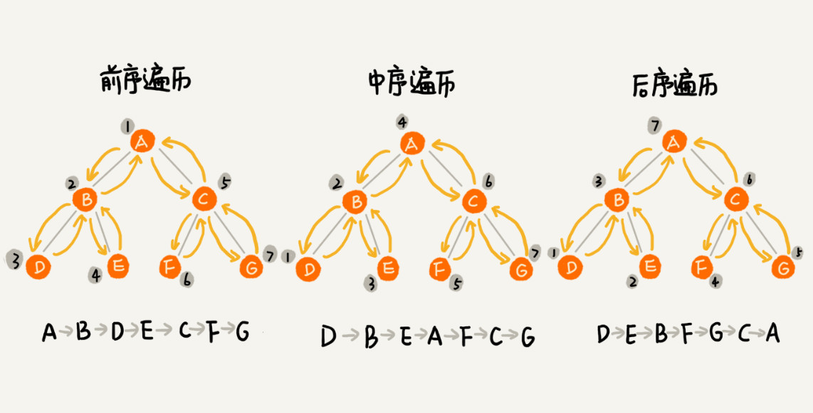
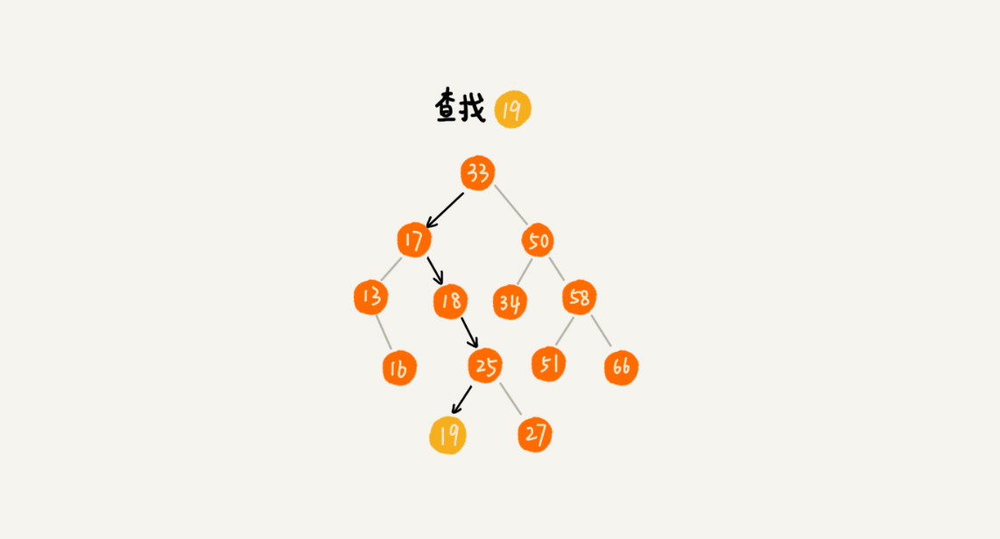

[TOC]

# 二叉树基础

## 一、二叉树常用概念

根节点、叶子节点、父节点、子节点、兄弟节点、**节点的度数**。需要特殊注意一下的有以下几个概念

* 节点的高度
* 节点的深度
* 节点的层数


此外，树的高度，就是根节点的高度。

## 二、特殊的二叉树

> 满二叉树和完全二叉树，满二叉树又是完全二叉树的特例。

完全二叉树是指，假设一个树的深度为 `d`，除了最底层，即 `d + 1` 层外，其他层的节点的度数都达到最大，而最底层的节点从左到右依次排列。

满二叉树是指，在完全二叉树的基础上，所有的叶子节点都在最底层。


上图中，一号为普通二叉树；二号为满二叉树；三号为完全二叉树。

## 三、二叉树的存储方式

> 二叉树在内存中的存储方式有哪些？什么样的二叉树适合存储在数组中？
>
> 二叉树可以用链表存储，也可以用数组存储。

用链表存储是最常用的，如下图


二叉树用数组存储，会比较浪费内存，但如果是完全二叉树，则可以利用数组来存储，如图


由图可知，哪怕是完全二叉树，数组也会浪费一个内存空间。如果不是完全二叉树，需要空出位置来表示`None`，这会浪费更多的内存空间。通过给树进行抽象标号，再由公式计算数组下标，来访问二叉树节点。例如，`A`的左子节点下标为`2 * i = 2i = 2, i = 1`。

## 四、二叉树的遍历方式

> 深度优先遍历`DFS`、广度优先遍历`BFS`，这两种是查找算法。

### 4.1 `Depth-First Search`

> 必须掌握；分为三种，`preorder`、`in-order`、`post-order`
>
> 深度优先遍历常用**递归**



> * 必须要掌握上述三种遍历的代码实现
> * 给定前序、中序，要会写出后序的遍历结果
> * 给定中序、后序，要会写出前序的遍历结果

```shell
前序：0 1 3 7 8 4 9 2 5 6
中序：7 3 8 1 9 4 0 5 2 6
==> 后序：7 8 3 9 4 1 5 6 2 0

中序：7 3 8 1 9 4 0 5 2 6
后序：7 8 3 9 4 1 5 6 2 0
==> 前序：0 1 3 7 8 4 9 2 5 6
```

## 五、二叉查找树

> `Binary search tree`，下面简写 `BST`
>
> 本质也是一种特殊的二叉树，又叫二叉搜索树。支持最坏时间复杂度为`O(n)`、最好时间复杂度为`O(logn)`的插入、删除、查找操作。

二叉查找树：在树中的任意一个节点，其左子树中的任意节点的值都要小于这个节点的值，其右子树中的任意节点的值都要大于这个节点的值。如下图


### 5.1 Search of BST

从根节点开始，if `root.val == target`，then return. 如果 `root.val < target`，就从左子树继续递归查找，如果 `root.val > target`，就从右子树继续递归查找。



### 5.2 Insertion of BST

从`root`开始，如果要插入的数据比节点的数据大，并且节点的右子树为空，就将新数据直接插到右子节点的位置，如果不为空，就递归遍历右子树，查找插入位置。如果要插入的数据比节点数值小，并且节点的左子树为空，就将新数据插入到左子节点的位置；如果不为空，就递归遍历左子树，查找插入位置。


### 5.3 Deletion of BST

> 删除除了下面这种实实在在的删除实现，还有取巧的做法，即找到要删除的节点之后进行标记。但这种做法会比较浪费内存，好处在于实现简单。

二叉查找树的删除操作分为三种情况：

* 第一种，要删除的`pnode`没有`cnode`，即叶子节点，则直接将指向`pnode`的指针指向`None`，例如删除`55`
* 第二种，要删除的`pnode`只有一个`cnode`，则直接将直接向`pnode`的指针指向其仅有的`cnode`，例如删除`13`
* 第三种，要删除的`pnode`有两个`cnode`，则需要从`pnode`的右子树中找到该右子树的最小节点`min_node`，然后将`min_node`替换到`pnode`上，然后再把`min_node`删除掉（`min_node`一定没有左子节点，如果有，就不是最小的了，**删除则对应第一或第二种情况**），例如删除`18`


### 5.4 Other operations of BST

二叉查找树不仅支持插入、删除、查找。还支持

* 快速查找最大、最小节点
* 查找前驱、后继节点
* **中序遍历树得到有序数组，时间复杂度为`O(n)`，很高效，因此`BST`也叫二叉排序树**

### 5.5 Extension of BST

> 在实际的软件开发中，很多时候树存储的并不是单纯的值，而是包含多个字段的对象。我们常会用对象的某一个`field`作为`key`来构建树。而对象的其他`field`，我们叫做**卫星数据**。
>
> 如果`BST`中存在两个`key`相同的节点，该怎么处理呢？常用方法有两种：

* 第一种：利用链表，或支持动态扩容的数组等数据结构，将`key`相同的数据放在同一节点上。
* 第二种：每个节点仍只存储一个数据，但如果有重复的数据，就把该重复的数据当成大于该数据处理，放在右子树中。根据这个思想，查找和删除操作也会发生变化。
  * 查找，按照普通的查找操作找到`target`后，继续到其右子树中查找，直到遇到叶子节点。
  * 删除，需要删除所有重复的值，基于查找，找到每个节点后，按照普通的删除操作，对节点进行删除。

### 5.6 Analysis of BST

> 只分析查找情况的时间复杂度。


上图中可以看出，二叉查找树的查找次数，**跟树的高度成正比**。

第一个二叉查找树退化成了链表，查找的时间复杂度为`O(n)`，这也是二叉查找树的最坏时间复杂度。

第三个是最好情况，二叉查找时完全二叉树，此时其时间复杂度为`O(logn)`

## 思考题

> 给定一组数据，比如 1，3，5，6，9，10。你来算算，可以构建出多少种不同的二叉树？

卡特兰数 $$C_n=(2n)!/(n+1)!n! $$

如果是完全二叉树，则为 $$n!$$，可以理解为，将完全二叉树放入数组中，数组有多少中组合方式。

> 散列表的插入、删除、查找时间复杂度可以做到常量级，非常高效。而二叉查找树在比较平衡的情况下，插入、删除、查找操作时间复杂度才是 `O(logn)`，相对散列表，二叉查找树好像并没有什么优势，那我们为什么还要用二叉查找树呢？

* 散列表如果没有进行特殊的改造，是没有办法高效输出有序数据的。而对于二叉查找树而言，只需要进行中序遍历即可，时间复杂度为`O(n)`
* 散列表扩容耗时，而且如果没有进行特殊改造，性能不稳定。而二叉查找树的性能也不稳定，但工程中常用的平衡二叉查找树是非常稳定的，时间复杂度稳定在`O(logn)`
* 尽管散列表的时间复杂度时常量阶，但由于散列表在冲突处理、散列计算和扩容上损耗，效率不一定会比`O(logn)`好
* 散列表考虑的因素比较多，构造复杂。而二叉查找树只需要考虑平衡性的问题，同时，平衡性问题的解决方案很成熟。

总结：二叉查找树和散列表各有优点，具体选择，还需具体分析

> 如何通过编程，求出一棵给定二叉树的确切高度呢？