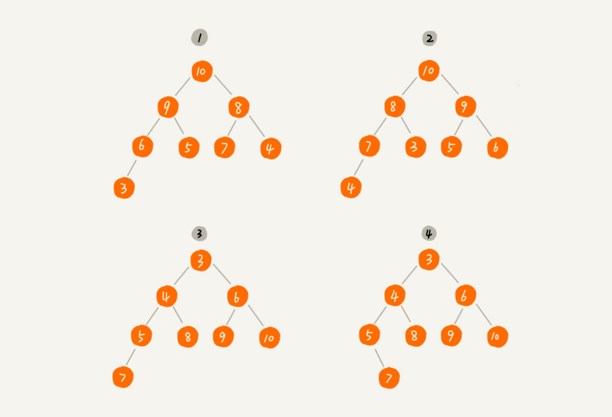

[TOC]

# 堆和堆排序（Heap）

## 1. What is Heap

堆是一种特殊的树，需要满足以下两点要求：

* 完全二叉树
* 树中任意节点的值大于等于（或小于等于）其左右子节点的值，需要额外说明的是，如果大于等于，则为大顶堆，如果小于等于，则为小顶堆。

上图中，1、2 为大顶堆，3 为小顶堆。4 不是堆。

## 2. How to implement a Heap

> 需要注意的是，根节点的标号是从 1 开始的，数组储存也是从下标为 1 开始的。这样子做会让理解更方便些，对于计算左右子节点和父节点的位置也友好。当然，也可以从 0 开始，只需要改变一下计算公式即可。
>
> 如果从 0 开始，则左子节点的下标为 $$2 * i + 1$$，右子节点为 $$2 * i + 2$$，父节点为 $$(i-1) // 2$$

堆是完全二叉树，完全二叉树用数组存储会节省空间，因为不需要存储节点的左右指针。同时，完全二叉树用数组存储，可以通过数组下标访问节点的左右子节点和父节点。

由上图可知，如果已知当前节点下标为 $$i​$$，则其左子节点为 $$2 * i​$$，其右子节点为 $$2 * i + 1​$$，父节点为 $$ i // 2​$$

## 3. The operations on the Heap

堆的操作主要有堆化、插入、删除。堆化是插入、删除的核心。插入是在最后插入，删除是指删除堆顶元素。

### 3.1 Heapify

堆化是指将不符合堆特性的树变成堆。一般出现在建堆、插入或删除元素后堆特性受到破坏，然后让结构重新符合堆的特性。堆化有两种，一种自上而下进行堆化，一种则是自下而上进行堆化。

自上而下的堆化，一般出现在建堆及删除元素中。

自下而上的堆化，则常出现在插入元素中。

### 3.2 Insertion

往堆中插入一个元素，一般是指在完全二叉树最后插入一个元素，如下图

此时插入元素 22，破坏了堆的特性，采用自下而上的堆化，让新插入的节点 22 与其父节点进行比较，如果新节点大于父节点，则交换两个节点的值，以此循环，直到新节点小于父节点。

### 3.3 Deletion

> 删除是指删除堆顶元素，大顶堆的堆顶元素是最大值，小顶堆的堆顶元素是最小值

假设目前操作的是大顶堆，删除完堆顶元素后需要自上向下进行堆化，但此时删除的元素位置为空，堆化后很大可能会出现数组空洞，而不是完全二叉树，如下图：

因此，删除的时候并不是直接释放，而是用堆数组中最后一个元素覆盖顶堆元素，再来堆化。

### 3.4 The analysis of  complexity

删除和插入的时间损耗来自于堆化，而堆化则顺着节点所在路径依次进行比较、交换，所以堆化的时间复杂度跟堆完全二叉树的高度成正比，我们知道具有 n 个节点的完全二叉树的高度不会超过 $$ log_2n$$，所以堆化、插入、删除的时间复杂度都为 $$logn$$。

## 4. Heap Sorting

> 堆排序是一个时间复杂度稳定在 $$nlogn$$ 的原地排序。堆排序主要分为两步：建堆和排序

### 4.1 Build heap

> There are two ways to build heap. 

第一种，如果数组有 n 个数据，先假设堆中只有一个元素，即数组下标为 1 的元素，然后将下标为 2 到 n 的元素采用前面所讲的插入操作，将元素插入到堆中。最后组织成堆。

第二种，也是一般最常使用的。**从后往前处理数组，从第一个非叶子节点开始，每个节点都自上而下进行堆化。**看图理解：

**注意：建堆的时间复杂度为 O(n)**

推导过程略为复杂，需要移步https://time.geekbang.org/column/article/69913查看

### 4.2 Sorting

本质上是进行了 `n - 1` 次删除操作，在前面讲的删除操作中，我们使用数组堆最后一个元素覆盖堆顶元素，而排序中，我们则是使用数组堆最后一个元素与堆顶元素进行交换，实际上，对于删除操作而言，覆盖还是交换并无所谓。每次将数组中的最大值移到后边之后，再对剩下的节点进行堆化，找到最大值，重复前面的操作，直到剩下一个节点，排序完毕。

### 4.3 Analysis

堆排序的建堆过程的时间复杂度为 O(n)，排序过程需要 $$nlogn$$，所以堆排序的整体时间复杂度为 $$nlogn$$。但堆排序并不是稳定的排序算法，因为交换操作可能会改变相同数据的原始相对顺序。

## Thinking questions

> Why quick sort performs better than the heap sort?

* 堆排序通过下标访问数据比快排效率低，因为快排访问数据时顺序访问，而堆排序是跳着访问的，例如堆化比较时，访问下标为1、2、4、8等等，这样子对 CPU 缓存是不友好的，所以效率偏低。
* 对于同样的数据，堆排序的数据比较交换的次数太多。
* 通过实验，堆排序的效率确实不如快排。

> 对于完全二叉树来说，下标从 2n+1 到 n 的都是叶子节点，这个结论是怎么推导出来的呢？

假设最后一个元素在数组中的下标为 n，则其父节点的下标为 $$n//2，取商$$，所以从下标为 $$ n // 2 + 1$$ 的元素起，就都是叶子节点了。

> Does the heap has any applications other than heap sort?

* 从大数量级数据中筛选出 top K 条数据，比如：从几十亿条订单日志中筛选出金额靠前的1000条数据。
* 在一些场景中，会根据不同优先级来处理网络请求，此时也可以用到优先级队列（用堆实现的数据结构），比如：网络框架Volley就用了Java中PriorityBlockingQueue，当然它是线程安全的。
* 可以用堆来实现多路归并，从而实现有序，leetcode上也有相关的一题：Merge K Sorted Lists
* 流里面的中值

  

